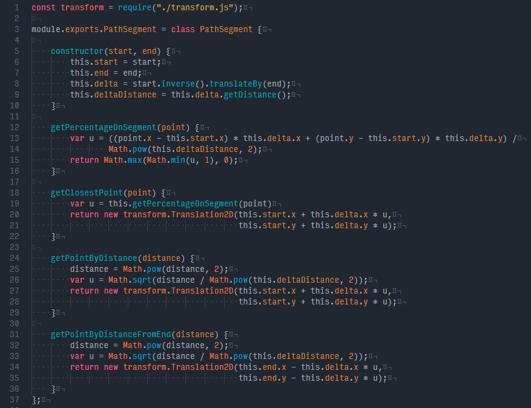
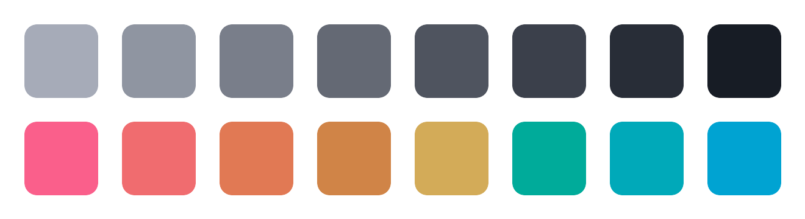

# summer-night-colors
[HCL](http://howlettstudios.com/articles/2017/5/6/the-problem-with-hsv)-based color palette for code editing and terminal use.





The font used in the screenshot is [Input Mono Narrow](http://input.fontbureau.com/). Summer Night Syntax is tested to work well with Javascript, CSS/LESS/SCSS, HTML, Java, Python, and C/C++.

### Features

Accent colors are chosen based on two analogous color scales (one warm and one cool) in the HCL space. Hue and chroma values are adjusted slightly to make the colors appear more consistent together but still easy to distinguish.

Monochrome colors are chosen from a scale with equidistant lightness in the HCL color space. Eight shades are generated, with the middle four being used as text colors and the darkest shade as a background color.

### Color Hex Codes
```
mono-1: #e2e8f5
mono-2: #c4c9d6
mono-3: #a6abb8
mono-4: #898e9a
mono-5: #6d727e
mono-6: #525762
mono-7: #393e48
mono-8: #21262f

hue-3: #fa5f8b
hue-5: #f06c6f
hue-7: #e17954
hue-6: #d08447
hue-4: #d3ab58
hue-8: #00ab9a
hue-2: #00a9b9
hue-1: #00a3d2
```

### Themes
- [Atom](https://atom.io/themes/summer-night-syntax): https://github.com/jackw01/summer-night-syntax
- [VS Code](https://marketplace.visualstudio.com/items?itemName=jackw01.summer-night-theme): https://github.com/jackw01/summer-night-vscode-theme
